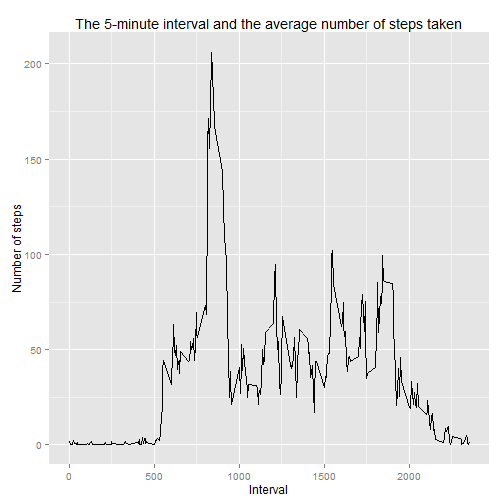
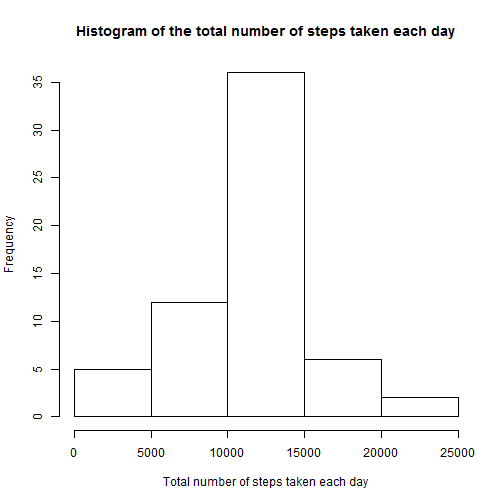
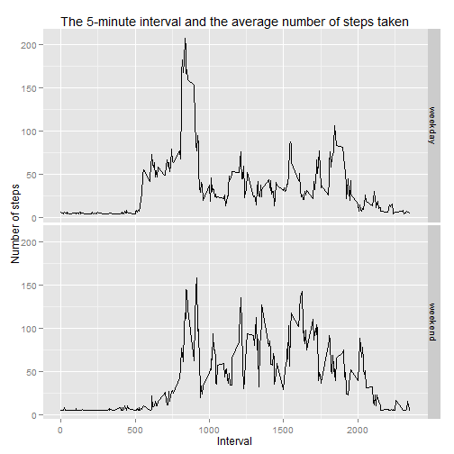

## Loading and preprocessing the data.


```r
unzip("activity.zip");
datas <- read.csv(file = "activity.csv", header = TRUE);
```

## What is mean total number of steps taken per day?


```r
data <- datas;
data <- group_by(data, date);
data <- summarise(data, count = sum(steps, na.rm = TRUE));

hist(data$count, 
     main = "Histogram of the total number of steps taken each day",
     xlab = "Total number of steps taken each day");
```

 

The mean of total number of steps taken per day is 9354.23. The median of total number of steps taken per day is 10395.

## What is the average daily activity pattern?


```r
data <- datas;
data <- group_by(data, interval);
data <- summarise(data, mean = mean(steps, na.rm = TRUE));

ggp <- ggplot(data, aes(x = interval, y = mean)) + 
        geom_line(stat = "identity") +
        labs(x = "Interval", y = "Number of steps") +
        labs(title = "The 5-minute interval and the average number of steps taken");
print(ggp);
```

 

The 5-minute interval '835' , on average across all the days in the dataset, contains the maximum number of steps.

## Imputing missing values.

(1). The total number of missing values in the dataset.


```r
data <- datas;
data <- data[is.na(data$steps),];
print(length(data$steps));
```

```
## [1] 2304
```

(2). Filling in all of the missing values in the dataset. 


```r
data <- datas;
data[is.na(data$steps), c("steps")] <- as.integer(mean(datas$steps, na.rm = TRUE));
```

(3). Create a new dataset that is equal to the original dataset but with the missing data filled in.


```r
data_new <- data;
```

(4). Make a histogram of the total number of steps taken each day and Calculate and report the mean and median total number of steps taken per day.


```r
data <- data_new;
data <- group_by(data, date);
data <- summarise(data, count = sum(steps, na.rm = TRUE));

hist(data$count, 
     main = "Histogram of the total number of steps taken each day",
     xlab = "Total number of steps taken each day");
```

 

The mean of total number of steps taken per day is 10751.74. The median of total number of steps taken per day is 10656. These values are differ from the estimates from the first part of the assignment, and they are increased.

## Are there differences in activity patterns between weekdays and weekends?

(1). Create a new factor variable in the dataset with two levels - "weekday" and "weekend" indicating whether a given date is a weekday or weekend day.


```r
Sys.setlocale(category = "LC_TIME", locale = "English");
data <- data_new;
data <- mutate(data, weekday = weekdays(as.Date(date)));
data[grepl("Saturday", data$weekday) | grepl("Sunday", data$weekday), c("weekday")] <- "weekend";
data[!grepl("weekend", data$weekday), c("weekday")] <- "weekday";
data$weekday <- as.factor(data$weekday);
```

(2). Make a panel plot containing a time series plot of the 5-minute interval (x-axis) and the average number of steps taken, averaged across all weekday days or weekend days (y-axis). 


```r
data <- group_by(data, weekday, interval);
data <- summarise(data, mean = mean(steps, na.rm = TRUE));

ggp <- ggplot(data, aes(x = interval, y = mean)) + 
        geom_line(stat = "identity") +
        facet_grid(weekday~., space = "free") +
        labs(x = "Interval", y = "Number of steps") +
        labs(title = "The 5-minute interval and the average number of steps taken"); 
print(ggp);
```

 


